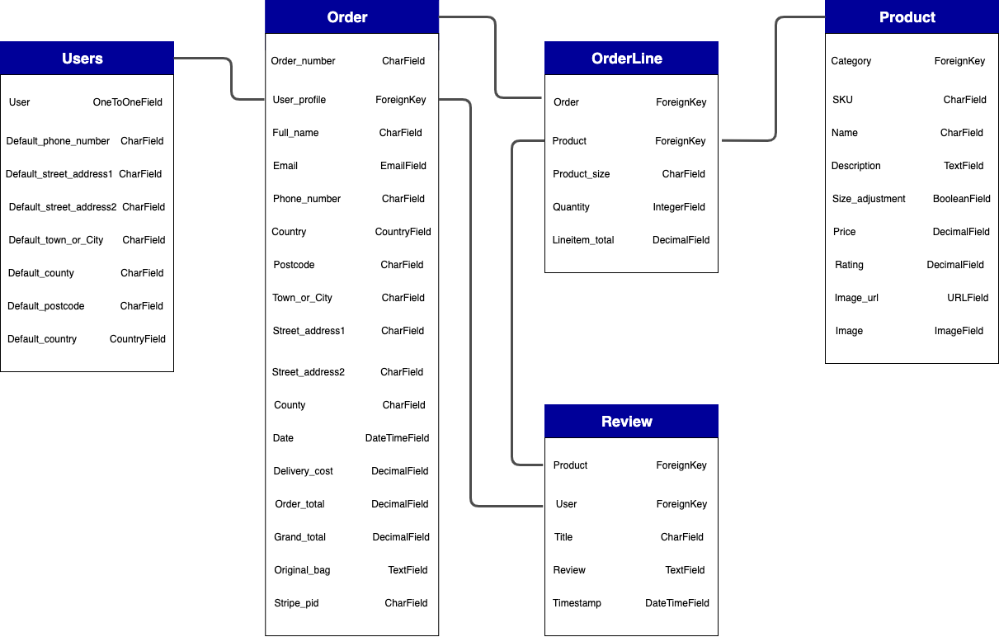

<p id="top"></p>

# MARSHAL UNISEX COLLECTIBLES WEBSITE

[View live deployment of site here](http://marshal-unisex-collectibles.herokuapp.com/)


Marshal Unisex Collectibles is an E-Commerce website for wrist watch brands. Majority of consumers now use online and digital channels to research prices or find product information. Whatever your interest, we tell your time in an extraordinary digital experience!
Moreso the site provides the necessary modern functionalities for the shop owner to manage vital content for products and services.

# Table of Contents

- [UX](#ux)
    - [Project Goals](#project-goals)
    - [UX Design](#ux-design)
    - [User Stories](#user-stories)
    - [Wireframes](#wireframes)
    - [Database Schema](#database-schema)
- [Features](#features)
    - [Existing Features](#existing-features)
    - [Features Left to implement](#features-left-to-implement)
- [Technologies Used](#technologies-used)
    - [Languages](#languages)
    - [Tools and Libraries](#tools-and-libraries)
- [Testing](#testing)
- [Deployment](#deployment)
    - [Deployment to Heroku](#deployment-to-heroku)
    - [Local Deployment](#local-deployment)
- [Credits](#credits)
    - [Code and Content](#code-and-content)
    - [Media](#media)
    - [Acknowledgements](#acknowledgements)
- [Disclaimer](#disclaimer)

_<div align="right"><p style="text-align: right"><a href="#top">Back to top</a></p></div>_

<a name="ux"/>

# UX

## Project Goals

The development of this project captures the essence of a full-stack site based around business logic used to control a centrally-owned dataset. The idea is to create an e-commerce site for wrist watch lovers using the Django framework with PostgreSQL database, then static file hosting with AWS, and a functional payment system using Stripe platform. 

## UX Design

The application was structured using bootstrap to maintain wide browser compatibility, consistency in design and extensibility to render responsive and modern website.

### Typography

The following fonts from [Google Fonts](https://fonts.google.com/) were used for the site:

**Roboto Slab** was used for the logo, navigation and titles of the site.

**Exo** was used for the contents of the site.

**Georgia** was used for the call to action button.


### Colors

The color scheme used in this project were meant to present the motifs as aesthetic pleasure to users.

-    `#000 - Black`

-    `#343a40 - Baltic Sea`

-    `#fafafa - Gray98`

-    `#330000 - Seal Brown`

-    `#121315 - Black Russian`

-    `#D05F59 - Moderate Red`

-    `#dc3545 - Amaranth`

-    `#aab7c4 - Heather`

-    `#000080 - Navy Blue`

-    `#007bff - Dodger Blue`

-    `#17a2b8 - Pelorous`

-    `#00d9ff - blue`

-    `#6c757d - Raven`

-    `#28a745 - Dark Lime Green`

-    `#ffc107 - Amber`

-    `#17a2b8 - Pelorous`


## User Stories

### User Stories for Customers

| **As a shopper or site user I would like to**             | **So that I can**                                       |
| --------------------------------------------------------- | ------------------------------------------------------- |
| Navigate throughout the site with ease                    | Find product to purchase in an organised format         |
| View each product as a single unit                        | Ascertain detailed content of a particular brand        |
| View my current bag total                                 | Keep track of my spending limit                         |
| Search the site quickly                                   | Locate a particular product of interest                 |
| Create my own account                                     | Have my profile with the option to login and logout     |
| Create my personal profile                                | Save my information for future delivery and easy entry  |
| Sort products by category, name, price or rating          | Make an informed decision before transaction            |
| Be able to add/remove or edit products in my bag          | Regulate my orders and checkout                         |
| Be able to select the quantity and wrist size             | Avoid being overcharged and ensure perfect fitting      |
| Ensure secure transactions                                | Be convinced about my payment                           |
| Receive a post email confirmation about my order          | Be assured and have records of my transactions          |
| Read input by reviewers                                   | Be preinformed about product and services               |
| Review purchased product                                  | Let prospective users know how I feel about the product |
| Be able to reset or recover my password                   | Retain my personal account                              |
| Be able to contact the company                            | Channel enquiries or seek solution to issues            |


### User Stories for Shop Administrators

| **As an administrator I would like to**                   | **So that I can**                                       |
| --------------------------------------------------------- | ------------------------------------------------------- |
| Manage Products and services                              | Maintain stock control system                           |
| Add/Edit/Update product listing when necessary            | Inform users about the latest product                   |
| Regulate prices                                           | Inform users about actionable prices                    |
| Delete products                                           | Remove sold products and Update Database accordingly    |
| Collate customer reviews                                  | Identify where to improve                               |


## Wireframes

The skeletal framework of this website was designed using [Balsamiq](https://balsamiq.com) as a visual guide to represent the page schematic and screen blueprint.

Links to final version of the wireframes can be found below:

* [Desktop Final Version](readme-files/desktop-wireframes.pdf)
* [Mobile Final Version](readme-files/mobile-wireframes.pdf)


## Database Schema

The database schema as it relates to each model is structured below:



_<div align="right"><p style="text-align: right"><a href="#top">Back to top</a></p></div>_


# Features

## Existing Features

### Home Page

-   The home page offers five nav bars to take users to relevant sections. 
    It contains full-width appealing Hero Image Heading Caption with a call-to-action button which take users straight to product listing. 
    
### User Account

This provides interface for new users to register, then sign into already created account.
The creation of the account requires a valid email and a password.
Account owners can access the following features:

-   Update profile information
-   View order history
-   Review purchased product

### Shopping Bag

-   The shopping bag populates all purchased product details, subtotal for items purchased and a grand total.
-   Users can remove items from the shopping bag and update quantities before checkout.
-   Thereafter users have the option to continue shopping or proceed to payment.

### Search bar

-   The Search functionality is present on all pages to enable users narrow down their search. 

### Product Listing

The product listing is structured to offer users multiple search criteria and quicker access to specific products.

-   Product listing can be sorted by Category, Name, Price, and Rating.
-   This can be done either in ascending or descending order.

### Product View

-   The product view populates the product details such as:
    -   Product name
    -   Category
    -   Image
    -   Description
    -   Price
    -   Rating
    -   Size adjustment
    -   Quantity increment/decrement functionality
    -   Add to bag and Keep Shopping buttons
    -   Review details if any.

### Checkout

-   Checkout allow users to enter their delivery and payment details initially.
-   The checkout details and delivery information are pre-filled with the information provided in the user's profile which can also be edited.
-   A summary of the order is populated on the checkout page
-   Users also have the option to adjust their bag before completion of order
-   Payment is made by card using [Stripe](https://stripe.com/)

### Review

-   The review form allow users to provide a feedback about their purchased product.

### Administrator features

-   The administrator has the sole right to product management section
-   An administrator can edit or delete a product to get users updated and engaged.

## Features Left to implement

-   I would like implement the social Media Login using the social-auth-app-django library.
-   Pagination functionality would divide content into discrete pages and make the content more organized thus improving user experience and scalability.

_<div align="right"><p style="text-align: right"><a href="#top">Back to top</a></p></div>_


# Technologies Used

## Languages

* [HTML5:](https://www.w3schools.com/html/default.asp)
    - HTML5 was used to code the content of the website.
* [CSS:](https://www.w3schools.com/css/default.asp)
    - CSS3 was used to style the content.
* [JavaScript:](https://www.w3schools.com/js/default.asp)
    - JavaScript was used to style the significant interactive functionality.
* [Python:](https://www.w3schools.com/python/default.asp)
    - Python was used for the project back-end functions.

## Tools and Libraries

* [Bootstrap:](https://getbootstrap.com/)
    - Bootsrap was used to render extensive prebuilt components and a responsive grid system.
* [Django:](https://www.djangoproject.com/)
    - Collection of Python libs that enables rapid development of secure and maintainable websites was used efficiently to create a quality Web application.
* [Django Crispy Forms:](https://django-crispy-forms.readthedocs.io/en/latest/) 
    - Django-crispy-forms was used to control the rendering behavior of Django forms in a very elegant way. It allows adjusting forms' properties (such as method and CSS classes) on the backend without having to re-write them in the template.
* [W3C Validator:](https://validator.w3.org/)
    - The W3C Markup Validator and W3C CSS Validator Services were used to validate every page of the project to clear syntax errors.
* [Font-Awesome:](https://fontawesome.com/)
    - Font Awesome was used on all pages throughout the website to add icons for aesthetic and UX purposes.
* [jQuery:](https://jquery.com/)
    - jQuery library was used to simplify the JavaScript and easier manipulation of DOM.
* [Tinypng:](https://tinypng.com)
    - Tinypng was used to compress the file size of PNG and JPG files.
* [Stripe:](https://stripe.com/)
    - Stripe platform was used for the card payment process.
* [Psycopg2:](https://pypi.org/project/psycopg2/)
    - Psycopg is designed for multi-threaded applications which enables the PostgreSQL database to function with Django
* [HTML and CSS Beautifier:](http://minifycode.com/html-beautifier/)
    - HTML and CSS was used to format the codes to make it more readable.
* [Gunicorn:](https://pypi.org/project/gunicorn/)
    - Gunicorn is a pure-Python HTTP server for WSGI applications which allows to run any Python application concurrently by running multiple Python processes within a single dyno.
* [Balsamiq:](https://balsamiq.com/)
    - Balsamiq wireframes was used to generate mockups and conceptual ideas for this website.
* [JSHint](https://jshint.com/) 
    - Used to test/validate JavaScript Code.
* [PEP8 Online Checker:](http://pep8online.com/)
    - P8P was used to verify that python coding conventions were applied to meet requirements.
* [drawio:](https://app.diagrams.net/)
    - Diagram software used to create the data modelling diagrams.
* [Git:](https://git-scm.com/)
    - Git was used for version control by utilizing the Gitpod terminal to commit to Git and Push to GitHub.
* [Gitpod:](https://www.gitpod.io/)
    - This project used Gitpod IDE throughout the development process.
* [Boto3:](https://boto3.amazonaws.com/v1/documentation/api/latest/index.html)
    - Boto3 is the AWS SDK for Python. It allows you to directly create, update, and delete AWS resources from your Python scripts.
* [AWS S3 Bucket:](https://aws.amazon.com/)
    - Amazon web services, S3 was used to store static and media files in production.

**External Hosting:**
* [GitHub:](https://github.com/)
    - The project used the GitHub hosting service to save the project in a repository. 
* [Heroku:](https://www.heroku.com/)
    - Heroku platform was used to deploy, manage, and scale the app. 

**Databases:**
* [SQlite3:](https://www.sqlite.org/)
    - SQLite is a C-language and cross-platform library used for development.
* [PostgreSQL:](https://www.postgresql.org/)
    - PostgreSQL is a powerful, open source object-relational database used for production. 

_<div align="right"><p style="text-align: right"><a href="#top">Back to top</a></p></div>_


# Testing

Throughout the development process of this project, Chrome DevTools was used for testing variations and simulation of mobile devices.
Thorough manual testing was done to ensure compliance with all code validators. 
The complete testing with regard to every detail can be found [here](TESTING.md).

_<div align="right"><p style="text-align: right"><a href="#top">Back to top</a></p></div>_


# Deployment

To be able to run this project, the following tools have to be installed before deployment:

-   Git
-   Python 3
-   PIP
-   Heroku CLI

More so the application would need an integral account on the following platform:

-   [Stripe](https://stripe.com/)
-   [Amazon AWS](https://aws.amazon.com/)
-   [GMail](https://mail.google.com/)

## Deployment to Heroku

To deploy Marshal Unisex Collectibles using Heroku platform, the following steps were taken:

-   Navigated to Heroku.com in web browser. Once there, Login or Sign Up for a new account.
-   Choose 'Python' as Primary Development Language.
-   Select "Create new app" from the Heroku dashboard.
-   Fill in the unique app name on the form and select corresponding region, then click on "Create app"
-   From the heroku dashboard of your application, click on "Deploy", then "Deployment method" and select GitHub to connect the application to your github repository
-   Click on Heroku Resources tab and navigate to Add-ons section to provision a new Postgres database for it.
-   Search in the Add-ons search bar for Heroku Postgres.
-   Select your Development plan (in my case - Hobby Dev Plan).
-   Upon establishing a link to the postgres database, click on the "settings" tab and on the button labelled "Reveal Config Vars".
-   Add the following configuration variables to the application:

    | **VARIABLE**          | **VALUE**                                                          |
    | --------------------- | ------------------------------------------------------------------ |
    | AWS_ACCESS_KEY_ID     | The key provided by AWS                                            |
    | AWS_SECRET_ACCESS_KEY | The secret key provided by AWS for authentication                  |
    | DATABASE_URL          | Postgres Database url provided by the Add-ons                      |
    | EMAIL_HOST_PASSWORD   | Password for designated E-mail address                             |
    | EMAIL_HOST_USER       | The E-mail address used to authenticate to the SMTP server         |
    | SECRET_KEY            | Your Django secret key                                             |
    | STRIPE_PUBLIC_KEY     | The public key provided by Stripe to Identify your account         |
    | STRIPE_SECRET_KEY     | backend secret key provided by Stripe                              |
    | STRIPE_WH_SECRET      | The webhook secret provided by Stripe                              |
    | USE_AWS               | True                                                               |

-   In the Heroku dashboard, deploy the application.
-   The site is now successfully deployed.
-   To view the site, click "View App"

### Setting-up Automatic Deployment from GitHub

To setup Automatic Deployment from GitHub:

-   Selected Deploy on Heroku dashboard.
-   Clicked on Connect to GitHub button.
-   Ensure GitHub profile is displayed, then add repository name (same as Heroku App), and clicked search.
-   Click connect button to find the repo.
-   Then now Enable Automatic Deployment.
-   Selected branch and clicked Deploy Branch button.
-   Once it's done, you'll see "Your App was successfully deployed!!!.
-   Click "View" to launch the new app. The deployed site is now available.

## Local Deployment

Running Marshal Unisex Collectibles Locally:

-   Navigate to the application's [repository](https://github.com/Seagather/Marshal-Unisex-Collectibles), click the "code" button and download the zip of the repository.

    Alternatively, you can clone the repository using the following line in your terminal:

        git clone https://github.com/Seagather/Marshal-Unisex-Collectibles.git

-   Access the folder in your terminal window and install the application requirements using the following command:

        pip3 install -r requirements.txt

-   Create a file containing your environmental variables called `env.py` at the root level of the application. It will need to contain the following lines and variables:

    ```
    import os

    os.environ["SECRET_KEY"] = "YOUR_DJANGO_SECRET_KEY"

    os.environ["STRIPE_PUBLIC_KEY"] = "YOUR_STRIPE_PUBLIC_KEY"
    os.environ["STRIPE_SECRET_KEY"] = "YOUR_STRIPE_SECRET_KEY"
    os.environ["STRIPE_WH_SECRET"] = "YOUR_STRIPE_WEBHOOK_SECRET"

    os.environ["DEVELOPMENT"] = "True"
    ```

    It's important to contained our environment variables within a hidden `env.py` file which should never be pushed to GitHub by ensuring `.gitignore` has it secured.

    You will also need to update the `SECRET_KEY` with your own secret key, as well as the strip keys and secret variables with those provided by corresponding applications.

-   The project should be active on localhost port 8000 now. 
-   In your terminal, type the command `python3 manage.py runserver`. 
-   Marshal Unisex Collectibles should now be running locally on your browser at the address `http://localhost:8000`.

-   After running Django initially, it will create the local database `db.SQLite3`.

-   Make all migrations:

    ```
    python3 manage.py makemigrations --dry-run
    python3 manage.py makemigrations
    python3 manage.py migrate --plan
    python3 manage.py migrate
    ```

-   Load data using fixtures:

    ```
    python3 manage.py loaddata products
    python3 manage.py loaddata categoriess
    ```

-   Create a superuser:

    ```
    python3 manage.py createsuperuser
    ***Enter username, email and password***
    ```

    You should now have a local copy of Marshal Unisex Collectibles.

_<div align="right"><p style="text-align: right"><a href="#top">Back to top</a></p></div>_


# Credits

## Code and Content

-   Inspiration and base code was derived from the Boutique Ado Project section of the Code Institute course. Code was modified to better fit my needs.
-   [Django Documentation](https://docs.djangoproject.com/en/3.1/) inquest for more knowledge.  

## Media
* [Am I Responsive:](http://ami.responsivedesign.is/) used for UX Image section
* [Unsplash:](https://unsplash.com/) for website image.
* [LogoMaker:](https://logomaker.com) was used for the logo design.

## Acknowledgements

* Special thanks to [Felipe Alarcon](https://github.com/felipe-alarcon), for his time, knowledge and clear guidance throughout this project.
* Thanks most of all to my beautiful wife, Yvonne, for her unending patience while I code all night for months.
* Most sincere appreciation to my fellow students, Slack Community and Support team at Code Institute for their immeasurable feedback.
* It has been an amazing experience.

## Disclaimer

* The content of this Website is for educational purposes only.

_<div align="right"><p style="text-align: right"><a href="#top">Back to top</a></p></div>_