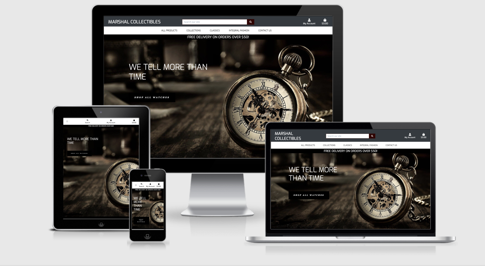

# MARSHAL UNISEX COLLECTIBLES WEBSITE

[View live deployment of site here](http://marshal-unisex-collectibles.herokuapp.com/)

Marshal Unisex Collectibles is an E-Commerce website for wrist watch brands. Majority of consumers now use online and digital channels to research prices or find product information. Whatever your interest, we tell your time in an extraordinary digital experience!
Moreso the site provides the necessary modern functionalities for the shop owner to manage vital content for products and services.

# Table of Contents

- [UX](#ux)
    - [Project Goals](#project-goals)
    - [UX Design](#ux-design)
    - [User Stories](#user-stories)
    - [Wireframes](#wireframes)
    - [Data Structure](#data-structure)
- [Features](#features)
    - [Existing Features](#existing-features)
    - [Features Left to implement](#features-left-to-implement)
- [Technologies Used](#technologies-used)
- [Testing](#testing)
- [Deployment](#deployment)
- [Credits](#credits)

_

<a href="#top">Back to top</a>

_

<a name="ux"/>

# UX

## Project Goals

The development of this project captures the essence of a full-stack site based around business logic used to control a centrally-owned dataset. The idea is to create an e-commerce site for wrist watch lovers using the Django framework with PostgreSQL database, then static file hosting with AWS, and a functional payment system using Stripe platform. 

## UX Design

The application was structured using bootstrap to maintain wide browser compatibility, consistency in design and extensibility to render responsive and modern website.

#### Typography

The following fonts from [Google Fonts](https://fonts.google.com/) were used for the site:

**Roboto Slab** was used for the logo, navigation and titles of the site.

**Exo** was used for the contents of the site.

**Georgia** was used for the call to action button.

#### Colors

The color scheme used in this project were meant to present the motifs as aesthetic pleasure to users.

-    `#000 - Black`

-    `#343a40 - Baltic Sea`

-    `#fafafa - Gray98`

-    `#330000 - Seal Brown`

-    `#121315 - Black Russian`

-    `#D05F59 - Moderate Red`

-    `#dc3545 - Amaranth`

-    `#aab7c4 - Heather`

-    `#000080 - Navy Blue`

-    `#007bff - Dodger Blue`

-    `#17a2b8 - Pelorous`

-    `#00d9ff - blue`

-    `#6c757d - Raven`

-    `#28a745 - Dark Lime Green`

-    `#ffc107 - Amber`

-    `#17a2b8 - Pelorous`

## User Stories

#### User Stories for Customers

| **As a shopper or site user I would like to**             | **So that I can**                                       |
| --------------------------------------------------------- | ------------------------------------------------------- |
| Navigate throughout the site with ease                    | Find product to purchase in an organised format         |
| View each product as a single unit                        | Ascertain detailed content of a particular brand        |
| View my current bag total                                 | Keep track of my spending limit                         |
| Search the site quickly                                   | Locate a particular product of interest                 |
| Create my own account                                     | Have my profile with the option to login and logout     |
| Create my personal profile                                | Save my information for future delivery and easy entry  |
| Sort products by category, name, price or rating          | Make an informed decision before transaction            |
| Be able to add/remove or edit products in my bag          | Regulate my orders and checkout                         |
| Be able to select the quantity and wrist size             | Avoid being overcharged and ensure perfect fitting      |
| Ensure secure transactions                                | Be convinced about my payment                           |
| Receive a post email confirmation about my order          | Be assured and have records of my transactions          |
| Read input by reviewers                                   | Be preinformed about product and services               |
| Review purchased product                                  | Let prospective users know how I feel about the product |
| Be able to reset or recover my password                   | Retain my personal account                              |
| Be able to contact the company                            | Channel enquiries or seek solution to issues            |

#### User Stories for Shop Administrators

| **As an administrator I would like to**                   | **So that I can**                                       |
| --------------------------------------------------------- | ------------------------------------------------------- |
| Manage Products and services                              | Maintain stock control system                           |
| Add/Edit/Update product listing when necessary            | Inform users about the latest product                   |
| Regulate prices                                           | Inform users about actionable prices                    |
| Delete products                                           | Remove sold products and Update Database accordingly    |
| Collate customer reviews                                  | Identify where to improve                               |

## Wireframes

The skeletal framework of this website was designed using [Balsamiq](https://balsamiq.com) as a visual guide to represent the page schematic and screen blueprint.

Links to final version of the wireframes can be found below:

* [Desktop Final Version](readme-files/desktop-wireframes.pdf)
* [Mobile Final Version](readme-files/mobile-wireframes.pdf)

## Data Structure

_

<a href="#top">Back to top</a>

_

# Features

## Existing Features

#### Home Page

-   The home page offers five nav bars to take users to relevant sections. 
    It contains full-width appealing Hero Image Heading Caption with a call-to-action button which take users straight to product listing. 
    
#### User Account

This provides interface for new users to register, then sign into already created account.
The creation of the account requires a valid email and a password.
Account owners can access the following features:

-   Update profile information
-   View order history
-   Review purchased product

#### Shopping Bag

-   The shopping bag populates all purchased product details, subtotal for items purchased and a grand total.
-   Users can remove items from the shopping bag and update quantities before checkout.
-   Thereafter users have the option to continue shopping or proceed to payment.

#### Search bar

-   The Search functionality is present on all pages to enable users narrow down their search. 

#### Product Listing

The product listing is structured to offer users multiple search criteria and quicker access to specific products.

-   Product listing can be sorted by Category, Name, Price, and Rating.
-   This can be done either in ascending or descending order.

#### Product View

-   The product view populates the product details such as:
    -   Product name
    -   Category
    -   Image
    -   Description
    -   Price
    -   Rating
    -   Size adjustment
    -   Quantity increment/decrement functionality
    -   Add to bag and Keep Shopping buttons
    -   Review details if any.

#### Checkout

-   Checkout allow users to enter their delivery and payment details initially.
-   The checkout details and delivery information are pre-filled with the information provided in the user's profile which can also be edited.
-   A summary of the order is populated on the checkout page
-   Users also have the option to adjust their bag before completion of order
-   Payment is made by card using [Stripe](https://stripe.com/)

#### Review

-   The review form allow users to provide a feedback about their purchased product.

#### Administrator features

-   The administrator has the sole right to product management section
-   An administrator can edit or delete a product to get users updated and engaged.

## Features Left to implement

-   I would like implement the social Media Login using the social-auth-app-django library.
-   Pagination functionality would divide content into discrete pages and make the content more organized thus improving user experience and scalability.

_

<a href="#top">Back to top</a>

_

# Technologies Used

**Languages:**
* [HTML5:](https://www.w3schools.com/html/default.asp)
    - HTML5 was used to code the content of the website.
* [CSS:](https://www.w3schools.com/css/default.asp)
    - CSS3 was used to style the content.
* [JavaScript:](https://www.w3schools.com/js/default.asp)
    - JavaScript was used to style the significant interactive functionality.
* [Python:](https://www.w3schools.com/python/default.asp)
    - Python was used for the project back-end functions.

**Tools and Libraries:**
* [Bootstrap:](https://getbootstrap.com/)
    - Bootsrap was used to render extensive prebuilt components and a responsive grid system.
* [Django:](https://www.djangoproject.com/)
    - Collection of Python libs that enables rapid development of secure and maintainable websites was used efficiently to create a quality Web application.
* [Django Crispy Forms:](https://django-crispy-forms.readthedocs.io/en/latest/) 
    - Django-crispy-forms was used to control the rendering behavior of Django forms in a very elegant way. It allows adjusting forms' properties (such as method and CSS classes) on the backend without having to re-write them in the template.
* [W3C Validator:](https://validator.w3.org/)
    - The W3C Markup Validator and W3C CSS Validator Services were used to validate every page of the project to clear syntax errors.
* [Font-Awesome:](https://fontawesome.com/)
    - Font Awesome was used on all pages throughout the website to add icons for aesthetic and UX purposes.
* [jQuery:](https://jquery.com/)
    - jQuery library was used to simplify the JavaScript and easier manipulation of DOM.
* [Tinypng:](https://tinypng.com)
    - Tinypng was used to compress the file size of PNG and JPG files.
* [Stripe:](https://stripe.com/)
    - Stripe platform was used for the card payment process.
* [Psycopg2:](https://pypi.org/project/psycopg2/)
    - Psycopg is designed for multi-threaded applications which enables the PostgreSQL database to function with Django
* [HTML and CSS Beautifier:](http://minifycode.com/html-beautifier/)
    - HTML and CSS was used to format the codes to make it more readable.
* [Gunicorn:](https://pypi.org/project/gunicorn/)
    - Gunicorn is a pure-Python HTTP server for WSGI applications which allows to run any Python application concurrently by running multiple Python processes within a single dyno.
* [Balsamiq:](https://balsamiq.com/)
    - Balsamiq wireframes was used to generate mockups and conceptual ideas for this website.
* [drawio:](https://app.diagrams.net/)
    - Diagram software used to create the data modelling diagrams.
* [Git:](https://git-scm.com/)
    - Git was used for version control by utilizing the Gitpod terminal to commit to Git and Push to GitHub.
* [Gitpod:](https://www.gitpod.io/)
    - This project used Gitpod IDE throughout the development process.
* [Boto3:](https://boto3.amazonaws.com/v1/documentation/api/latest/index.html)
    - Boto3 is the AWS SDK for Python. It allows you to directly create, update, and delete AWS resources from your Python scripts.
* [AWS S3 Bucket:](https://aws.amazon.com/)
    - Amazon web services, S3 was used to store static and media files in production.

**External Hosting:**
* [GitHub:](https://github.com/)
    - The project used the GitHub hosting service to save the project in a repository. 
* [Heroku:](https://www.heroku.com/)
    - Heroku platform was used to deploy, manage, and scale the app. 

**Databases:**
* [SQlite3:](https://www.sqlite.org/)
    - SQLite is a C-language and cross-platform library used for development.
* [PostgreSQL:](https://www.postgresql.org/)
    - PostgreSQL is a powerful, open source object-relational database used for production. 

_

<a href="#top">Back to top</a>

_

# Testing
